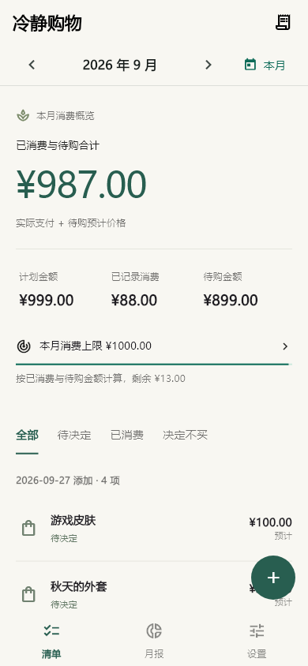
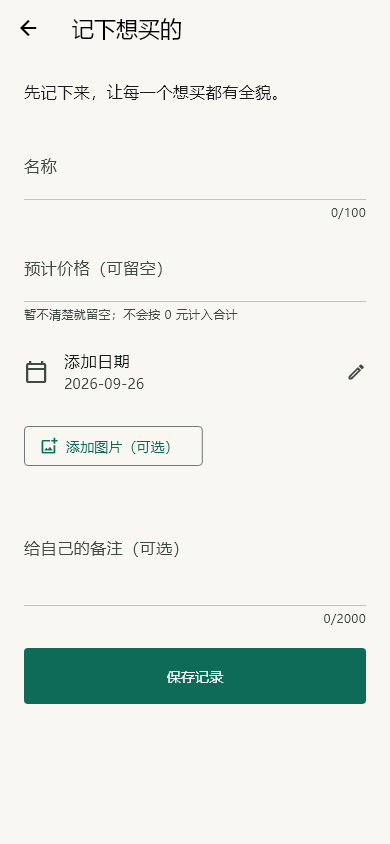

# 01 · 购物冷静清单

个人 App 项目 01：一个免登录、数据保存在本机的 Android 购物计划应用。

把想买的东西先记下来，看看它们加在一起要花多少钱，再决定买不买。

<p>
  
  
</p>

## 当前版本：0.1.1

**[下载 Android 安装包（APK，约 52.1 MiB）](https://github.com/Jaden-debug-beep/calm-shopping/releases/download/v0.1.1/calm-shopping-0.1.1.apk)** · [版本说明与校验值](https://github.com/Jaden-debug-beep/calm-shopping/releases/tag/v0.1.1)

支持 Android 7.0 及以上。下载后在手机上打开 APK 安装；当前为个人试用版。

- 手动记录名称、预计价格与日期，图片可选。
- 按添加日期分组，按月查看计划总额、已记录消费和剩余待购。
- 价格未知单独提示；已消费必须填写实付金额，支持补记消费。
- 不买保留历史，跨月由自己选择保留、不买或稍后处理。
- 月报、可选消费上限、购买原因和买后感受。
- 本地保存，完整备份包含图片；恢复前校验并确认覆盖。
- 简洁界面：留白、细分隔线、小圆角，没有截图识别、分享导入或粘贴解析。

支持 Android 7.0 及以上。当前为个人试用版本，尚未做完整真机兼容性验证。

## 开源来源

基于 [Smart Expense Tracker](https://github.com/erdipakrana/expense_app) 的 MIT 源码改造，保留 LICENSE，并在复用记录中标注上游基准提交。

[复用清单](docs/REUSE.md)说明沿用了哪些代码、修改了哪些部分，以及按本产品新增的业务逻辑。原始 Dart 源码保存在 `upstream_reference/`，不参与当前应用编译。

## 构建

开发环境：Flutter 3.47.5 / Dart 3.13.4，完整 JDK 17，Android SDK。Windows 推荐把项目与 Flutter SDK 放在英文路径。

```sh
flutter pub get
flutter analyze
flutter test
flutter build apk --release
```

APK 输出到 `build/app/outputs/flutter-apk/app-release.apk`。本地交付副本位于 `dist/`，不纳入 Git 源码仓库。

当前构建使用本机调试签名供个人试用，正式发布前需要配置自己的发布签名。仓库不包含任何签名密钥。

## 文档与验证

- [统计口径与跨月规则](docs/ACCOUNTING.md)
- [0.1.0 验证记录](docs/VALIDATION.md)：13 项自动测试通过。
- [0.1.1 界面更新](docs/UI-0.1.1.md)：界面操作测试、静态检查和打包通过。
- [月报预览](docs/screens/report.png) · [设置预览](docs/screens/settings.png)

预览图使用测试数据，首次安装是空清单。系统相册选择和文件保存/恢复仍需真机验证。

截图用例默认跳过。重新生成预览时运行以下命令，并将路径替换为本机 Flutter SDK 和中文字体文件：

```sh
flutter test test/preview_test.dart --update-goldens --dart-define=CAPTURE_PREVIEW=true --dart-define=FLUTTER_SDK=/path/to/flutter --dart-define=PREVIEW_FONT=/path/to/chinese-font.ttf
```

## 许可证

[MIT](LICENSE)。上游版权归原作者 Dipak Rana，完整许可保留在仓库与应用内。
